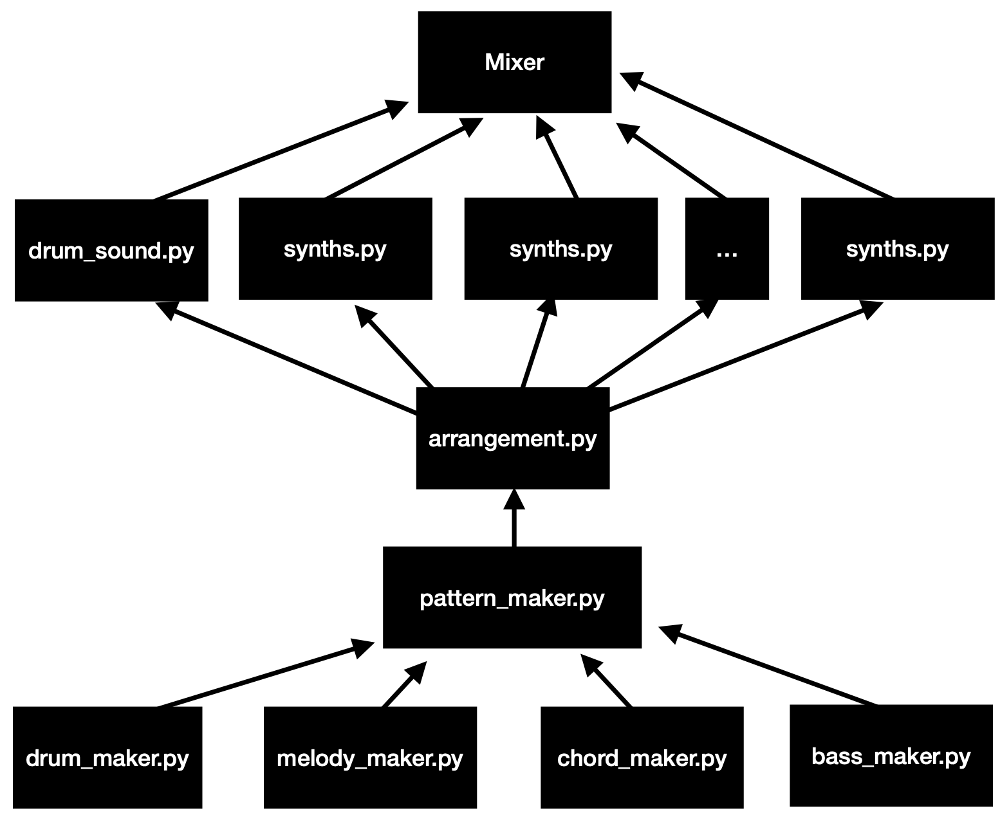

# Signal Flow Description

Here I'll describe how I plan to make things work. It is logged out by date because the whole flow is subject to change.

## 2022/01/04

`drum_maker`, `melody_maker`, `chord_maker` and `bass_maker` make the midi notes that will (hopefully) fit together. They receive information from `pattern_maker`: the BPM, the chord pattern, temporal signature (which will probably be 4/4 for first tests) and instruments used. They then produce the midi notes for each of these instruments, each produce a single pattern that will be put together in the arrangement.

The `arrangement` section receives the patterns from `pattern_maker` and arranges them together. This means that the different loops have to bbe placed here even if they have different lengths.

Once the arrangement is done, the sequences are simply fed into the sound generators. Finally they are mixed together. I have not figured out how to do this yet, but I think I'll be making a filtered RMS reader thingie to be able to mix stuff.

